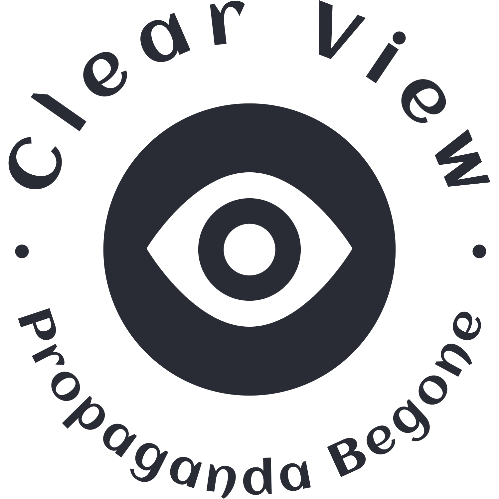

# FullView
FullView is a cyber project made by myself in order to learn machine learning and use it to detect propaganda.  
This app is made to search a subject (for example: minimum wage) and get articles from the internet.  
Said articles are ranked by least amount of propaganda and most and given to the user.  
The client gives the subject to the server and the server returns it, whilst also saving the results.  
By saving the result a database of answers is created to make responding time lower.  

